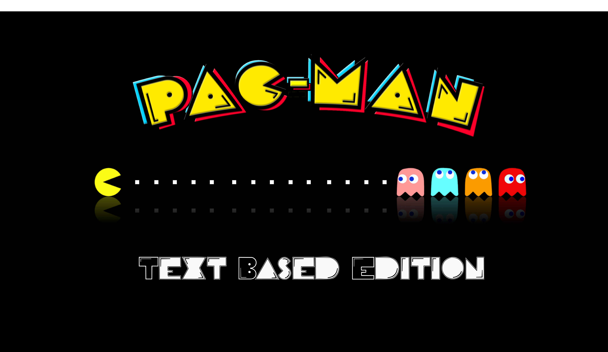

# lpoo-2020-g46
## Pac-Man `Text Based Edition`

Pac-Man is a classic arcade style maze chase video game from 1980 developed by *Namco*. The player guides the Pac-Man about the 
maze munching up the Dots in his path. Four Ghost Monsters - Inky, Blinky, Pinky, and Clyde - chase after the 
Pac-Man trying to capture and deflate him. The Pac-Man can counter attack by eating the big, Power Capsule that 
enables him to overpower the Monsters for additional score. After all the dots are gobbled up, the screen is cleared, 
and the Pac-Man continues for another round. Each rack features a special Fruit Target in the maze, which if eaten, 
earns Bonus Points. Players start with three Pac-Men. An additional Pac-Man is awarded for 10,000 points.

This iteration tries to make justice to the original game by providing a text-based solution to the beloved arcade classic.