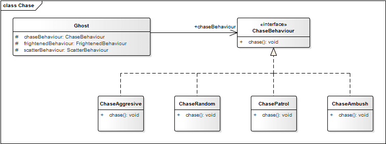
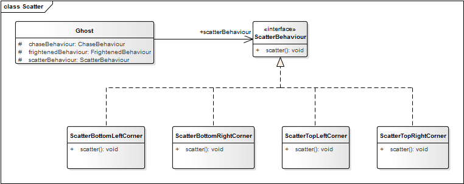
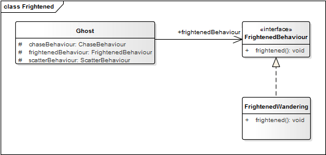
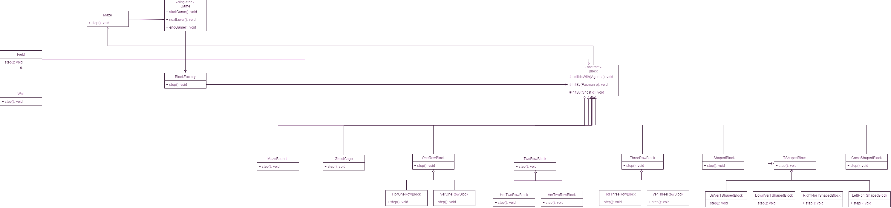
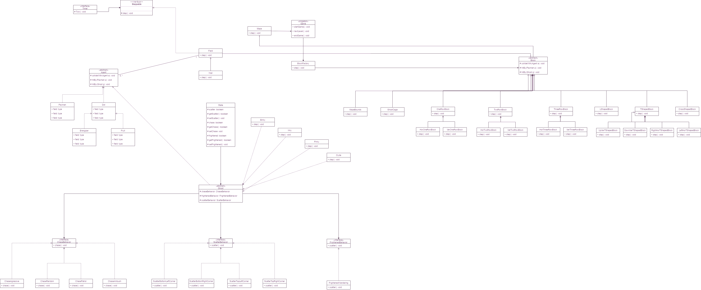

# lpoo-2020-g46
## Pac-Man

Pac-Man is a classic arcade style maze chase video game from 1980 developed by *Namco*. The player guides the Pac-Man about the 
maze munching up the Dots in his path. Four Ghost Monsters - Inky, Blinky, Pinky, and Clyde - chase after the 
Pac-Man trying to capture and deflate him. The Pac-Man can counter attack by eating the big, Power Capsule that 
enables him to overpower the Monsters for additional score.

This project was developed by *Tiago Filipe Lima Rocha* and *Dániel Morvai*  for LPOO 2020.

### Implemented features

* **Moving pacman**: The player controls Pac-man through a maze using the keyboard

* **Avoiding walls**: The maze consists of wall, which the pacman can't walk through.

* **Move to opposite side**: If pacman walks off the maze where there is no wall it teleports to the opposite side of the maze.

* **Eating pac-dots**: If Pacman hits a dot on the maze, it collects it.

* **Eating Ghosts**: If Pacman hits a ghost on the maze while they're frightened (after eating a power pellet), it collects it.

* **Ghosts**: Four ghosts roam the maze, trying to catch Pac-Man

* **Ghost strategies**:  Ghosts have intelligent strategies implemented, according to each ghost "personality".

* **Completing a level**: When all pac-dots are eaten, the level is completed and a congratulation screen is displayed within the playfield.

* **Loosing lives**: If a ghost touches Pac-Man, a life is lost. The initial number of lives is three.

* **Loosing the game**: When all lives have been lost, the game ends and a game over screen is shown in the playfield. 

* **Score**: The score is updated incrementally with each pac-dot summing 10 pts, saved to a file and showcased at game over.

### Design

#### Sepparate the logic from the viewable content while maintaining an updatable structure

**Problem in Context**

**The Pattern**

We solved the problem by implementing a variant of the MVC pattern.

**Implementation**

In our rendition of the game, we created a Screen class that's responsible for the creation of the screen and terminal, each class has a draw method that is called in a steppable class that uses a timer to keep track of each step of everything in the game, this works as our view. And then in the drawables package lie all the our models within the game (i.e. the pacman, pellets, ghosts, maze, etc). The game loop acts as the controller.

**Consequences**

This solution (1) makes our code more reusable; 
(2) allowed us for simmultaneous development, as we worked simultaneously and uninterruptedly on the controller or the model or the views;
(3) has high cohesion and loose coupling, enabling for logical groupings of related actions on a controller as well as the views for a specific model, (for instance the movable agents have all logic in common being grouped together, and in another group we have the non-movable agents that behave differently and consist of another group);
(4) models can have multiple views;
(5) provides for better testability value;

#### Decouple the progression of game time from user input and processor speed.

**Problem in Context**

Keep the game running even when the user isn't providing any input. And when he does, update it's current state and render everything accordingly.

**The Pattern**

We solved the problem by implementing the Game Loop pattern. The game loop runs continuously during gameplay. Each turn of the loop, it processes user input without blocking, updates the game state, and renders the game. It tracks the passage of time to control the rate of gameplay.

**Implementation**

Upon initialization of the loop, all the assets are first loaded up and stored in variables. Those variable are then used within the loop, being update with each iteration according to the current state of the game and the current processed user input in the event loop, providing logic and renderization of the game. 

**Consequences**

This solution provided us total control over the development of the game, designing it specifically for our needs as the development progressed. It made everything very maleable and easily changeable.
Not only that but it allows us to control the game's speed at a fixed update time step, variable rendering, It adapts to playing both too slowly and too fast. As long as the game can update in real time, the game won’t fall behind. If the player’s machine is top-of-the-line, it will respond with a smoother gameplay experience.

#### Timing should be consisten for the whole game

**Problem in Context**

The entities behave according to their own logic at every refresh period of the game. The timing of these periods must be the same. Otherwise characters will not move deterministically and the terminal's refresh functions may overlap each other. 

**The Pattern**

We solved the problem by implementing a Timer class, that uses the **Singleton** pattern. It restricts the instantiation of a class to one single instance. That way every user of the class can only access that single instance and there won't be timing inconsistencies.

**Implementation**

In order to restrict clients from creating instace of the Timer class we blocked the constructor of the class using the *private* keyword. We used a *getTimer()* method which checks wheter the instance already exists or not and based on this information returns it. 

This class can be found in the following file:
* [Timer](https://github.com/FEUP-LPOO/lpoo-2020-g46/blob/master/src/main/java/step/Timer.java)

**Consequences**

*Pros* of Singleton pattern in the current design:
* Same timing in the whole game.
* Resource friendly: a new instance won't be created every time another class needs timing.
* The class has flexibility changing the instantiation process.

*Cons* of Singleton pattern:
* Violates SRP because it controls it's instantiation and lifecycle process.
* Difficult to mock the class at unit tests.

__________________________________________________________________________________________________________________________________________________________________________________________________________________________________________________________________________________________

#### Collision of obects should be flexible

**Problem in Context**

The game has many types of objects (Pacman, Walls, Ghosts, Dots, etc..) which collide with each other from time to time. Checking the current object type at each collision violates OCP, which makes the code harder to change later on.  

**The Pattern**

We solved the problem by using the **Visitor** pattern. This pattern can be used for various problems. We used it to make our collision algorithm work in the class hierarchy. Therefore we can add new operations to existing object structures without modifying the structures themselves. 

**Implementation**

We implemented the pattern the following way:

The *Agent* class represents both the visitable Elements and the Visitors with the *collideWith* and *hitBy* methods. Each extended class have to implement these methods according to their behaviour. 

An *Agent* steps on a field by calling its *accept* function, which starts the visitor pattern by making the caller agent visit each other agents which are currently standing on the desired field.

Examples for the pattern: when a *Dot* is hit by a pacman the pacman's points are increased. When a *Ghost* is hit by a pacman (or the other way around) the pacman dies. 

These classes can be found in the following files:
* [Agent](https://github.com/FEUP-LPOO/lpoo-2020-g46/blob/master/src/main/java/drawables/agents/Agent.java)
* [Pacman](https://github.com/FEUP-LPOO/lpoo-2020-g46/blob/master/src/main/java/drawables/agents/Pacman.java)
* [Dot](https://github.com/FEUP-LPOO/lpoo-2020-g46/blob/master/src/main/java/drawables/agents/collectibles/Dot.java)
* [Ghost](https://github.com/FEUP-LPOO/lpoo-2020-g46/blob/master/src/main/java/drawables/agents/ghosts/Ghost.java)
* [Field](https://github.com/FEUP-LPOO/lpoo-2020-g46/blob/master/src/main/java/drawables/layout/Field.java)

**Consequences**

*Pros* of Visitor pattern in the current design:
* We only need the change the *hitBy* methods of agents if we want to change their behaviour.
* Adding new classes with new behaviour is easy. We don't need to work with the collision logic. 

*Cons* of Visitor pattern:
* The *Visitor* calls operations on the *Element* (ghost kills pacman, calls die()) which can cause side-effects.

__________________________________________________________________________________________________________________________________________________________________________________________________________________________________________________________________________________________

####  Ghosts should have independent behavior, according to each of their "personality".

**Problem in Context** 

Each of the four ghosts has a different behaviour or "personality", depending on their current mode. The ghosts change mode during game play from 
scattering to the corners of the maze, to chasing Pac-Man and also to being frightened when Pac-Man picks up a Power-Pellet.
     
The following table illustrates the types of movement and also how the individual ghosts behave during those types of movement.

Ghost Name         | Chase      | Scatter             | Frightened | 
------------------ | ---------- | ------------------- | ---------- |
**Blinky (Red)**   | Aggressive | Top Right Corner    | Wandering  |
**Pinky (Pink)**   | Ambush     | Top Left Corner     | Wandering  |
**Inky (Cyan)**    | Patrol     | Bottom Right Corner | Wandering  |
**Clyde (Orange)** | Random     | Bottom Left Corner  | Wandering  |

###### Chase

In "Chase" mode, the ghosts are trying to find and capture Pac-Man. Each of the four ghosts has a unique behaviour while chasing Pac-Man: 

* Blinky the red ghost is very aggressive in its approach while chasing Pac-Man and will follow Pac-Man once located;
* Pinky the pink ghost will attempt to ambush Pac-Man by trying to get in front of him and cut him off;
* Inky the cyan ghost will patrol an area and is not very predictable in this mode;
* Clyde the orange ghost moves in a random fashion.

###### Scatter

In "Scatter" mode, the ghosts will stop chasing Pac-Man and each will move into its respective corners for a few seconds:

* Blinky the red ghost moves towards the top right corner;
* Pink the pink ghost moves towards the top left corner;
* Inky the cyan ghost moves towards the bottom left corner; 
* Clyde the orange ghost moves towards the bottom left corner. 

This mode lasts only for a few seconds and then changes back to the "Chase" mode.

###### Frightened

The “Frightened” mode occurs when Pac-Man eats an energizer within the maze. There are four energizers located in the maze and all four ghosts change 
mode. The ghosts turn dark blue and wander around in the maze being vulnerable. They will flash moments before they return to either the Scatter or 
Chase mode.     
      
**The Pattern**

We solved the problem by using the **Strategy Pattern**. According to the Strategy Pattern, the behaviour that varies is placed into a separate class to allow us to make changes to those behaviours without affecting the parts that stays the same. Furthermore, the pattern aligns to the design principle to “Program to an Interface, and not to an Implementation” so that the three modes of a ghost can be defined as interfaces, and the different implementations of the modes of movement can be implemented in separate classes.

**Implementation**

To implement the different ghost behaviours, the instances of the Ghost class will use the behaviour represented by an interface (ChaseBehaviour, ScatterBehaviour & FrightenedBehaviour) to ensure that the different implementations of each behaviour is not implemented within the Ghost class.

The Ghost class has a ChaseBehaviour, ScatterBehaviour and a FrightenedBehaviour. The HAS-A relationship refers to the composition of the classes. 
Now it is possible to compose the Ghost class to in such a way that each of the different types of ghosts can be composed of different implementations 
for each of the 3 modes of movement.

The **chase behaviour** of the ghosts varies, and the implementation of each of the parts are removed into a separate class. Hence, the algorithm to chase aggressively, 
ambush, patrol and random is placed in separate classes. An interface (ChaseBehaviour) is created to allow for the composition between the Ghost class and the 
different implementations of the Chase behaviour.

The **scatter behaviour** of the ghosts varies, and the implementation of each of the parts are removed into a separate class. Hence, the algorithm to scatter to the 
top-left, top-right, bottom-left and bottom right corners is placed in separate classes. An interface (ScatterBehaviour) is created to allow for the composition 
between the Ghost class and the different implementations of the Scatter behaviour.

The frightened behaviour of the ghosts may does not vary, however the implementation of is still removed into a separate class. Hence, the algorithm to wander
around is placed in separate class. An interface (FrightenedBehaviour) is created to allow for the composition between the Ghost class and the implementation 
of the Wandering behaviour.

The Strategy Pattern assists with the design of the different behaviours of the ghosts in Pac-Man. Applying the Strategy Pattern to the ghost movement design, 
the solution become reusable, extensible, maintainable and allows for change without major impact to the rest of the code.

**Consequences**

The Strategy Pattern assists with the design of the different behaviours of the ghosts in Pac-Man. Applying the Strategy Pattern to the ghost movement design, 
the solution become reusable, extensible, maintainable and allows for change without major impact to the rest of the code.

__________________________________________________________________________________________________________________________________________________________________________________________________________________________________________________________________________________________

#### Modular approach to level design

**Problem in Context**

Building a new maze proved to be quite a long and tedious chore. Without the proper tools and guidelines, structuring a new level seemed like an arbitrary thing without any kind of rule to it and that could be dangerously chaotic. To make the process of building the maze as seamless and efficient as possible, we tried to come up with ways to promote a reusable code base for level design and fast maze building in an orderly fashion according to the symmetric nature of Pac-Man's levels. 

**The Pattern**

We solved the problem by using the **Factory Pattern**. The Factory method is a creational design pattern that provides an interface for creating objects without specifying their concrete classes. It defines a method that we can use to create an object instead of using its constructor. The important thing is that the subclasses can override this method and create objects of different types.
As such a Maze should be a composition of blocks that in turn are an aggregation of walls, and these blocks can be of any given type.

**Implementation**

Our Application has a MazeBuilder helper class, that firstly loads all the playable fields into the map, thus creating the playfield and then loads all the blocks which comprise of the maze walls. This last step is achieve with a BlockFactory class, used to create all the Blocks of a given Maze. It essentially makes a given Block in a certain position on the Maze (or map coordinate (x, y)) based on a given input. Each Block subtype has a draw() and an initBlock() method and it's implementation varies according to the kind of block this subtype represents, these two methods are called on instantiation. The BlockFactory returns a new instance of a given Block depending on the input it's method makeBlock() received, as the deciding factor is parametrized on this function in the form of an enum representing block types. Thus, it can create any kind block: simple one, two or three row blocks, T-Shaped blocks, L-Shaped blocks, Cross-Shaped blocks the Ghost house and even the map boundaries which we consider a block also.

**Consequences**

Using a factory allows us to have a singular place in which to examine and modify our object creation. Having a factory makes it convenient and easy to modify their specific creation processes while making complex object instantiation just as easy and convenient. It is also seamless to add new kinds of blocks allowing us to create different and creative mazes on the go.
__________________________________________________________________________________________________________________________________________________________________________________________________________________________________________________________________________________________

##### General Overview of the Design

### Known code smells and refactoring suggestions

#### Refused Bequest
This problem can be found in the [Dot](https://github.com/FEUP-LPOO/lpoo-2020-g46/blob/master/src/main/java/drawables/agents/collectibles/Dot.java) class since it doesn't use the *collideWith(agent: Agent)* inherited method because it doesn't move so it won't collide with anything. 

[Pacman](https://github.com/FEUP-LPOO/lpoo-2020-g46/blob/master/src/main/java/drawables/agents/Pacman.java) cannot be hit by another Pacman so it's *hitBy* method is also empty. 

The reason for this problem is the *Visitor pattern*. Each class extending *Agent* has to implement the methods needed for the pattern.

The ghost's state logic is overly complex and could be done with the State pattern instead.

Ways to improve:
* implementing different logic for collisions;
* Dividing *Agent* superclass into new superclasses which don't leave methods empty. (Extract subclass);
* Implementing the State pattern;

#### Speculative Generality
[Collectible](https://github.com/FEUP-LPOO/lpoo-2020-g46/blob/master/src/main/java/drawables/agents/collectibles/Collectible.java) class has no function at the moment. It is created for future purposes in case of introducing a new kind of collectibles (power dot) 

A way to impore this is to delete the class and leave its creation for later. (Collapse hierarchy)

### Testing 
* Screenshot of coverage report.
* Link to mutation testing report.

### Self-evaluation
* Tiago Filipe Lima Rocha: 50%
* Daniel Morvai: 50%
